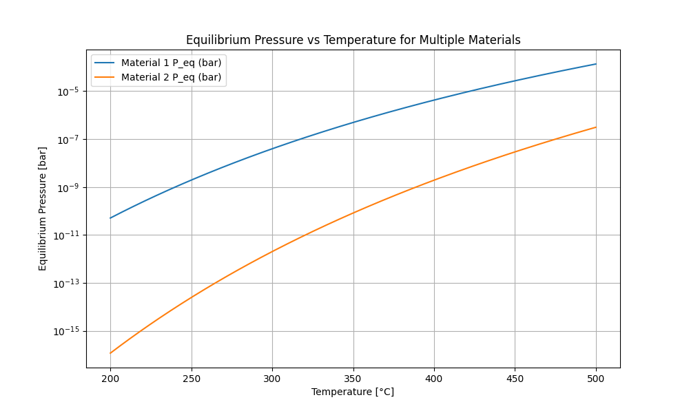
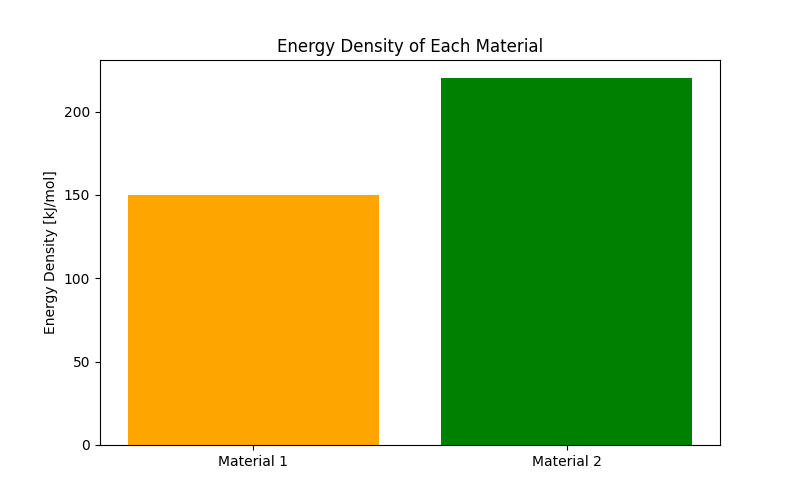
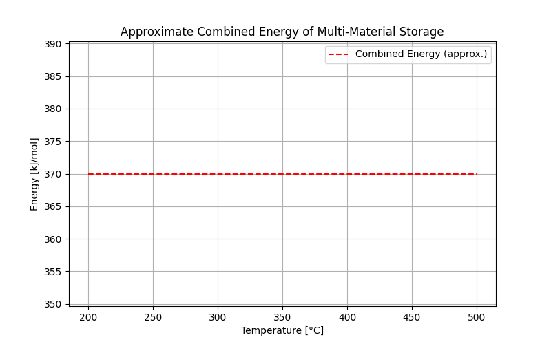

# Multi-Material Thermochemical Heat Storage Optimization

## 📌 Overview
This project focuses on optimizing **high-temperature thermochemical heat storage using multiple materials** to maximize energy density and maintain stable output temperatures.  
- **Multi-material modeling** to leverage complementary reaction properties.  
- **Energy density analysis** to evaluate storage efficiency.  
- **Output temperature control** through material selection and system parameters.  

This approach allows designing **practical, high-performance heat storage systems** for industrial applications.

## 🎯 Objectives
- Explore how **different material combinations** affect energy storage capacity.  
- Identify the **best material pairing** to maintain a target output temperature.  
- Understand **trade-offs between material cost, energy density, and thermal stability**.  

## 🛠️ Methodology
1. Define thermodynamic parameters (ΔH, ΔS) for each material.  
2. Model energy storage and release for single and multi-material setups.  
3. Simulate system behavior over charging/discharging cycles.  
4. Generate comparative plots for energy density and output temperature.  

## 📊 Key Results
- **Energy density graphs** for different material combinations.  
- **Temperature vs time plots** showing stable output across cycles.  
- Recommendations for **optimal material selection** for practical applications.

## 📷 Example Output



## 🚀 How to Run
```bash
python Multi-Material Thermochemical Heat Storage.py
